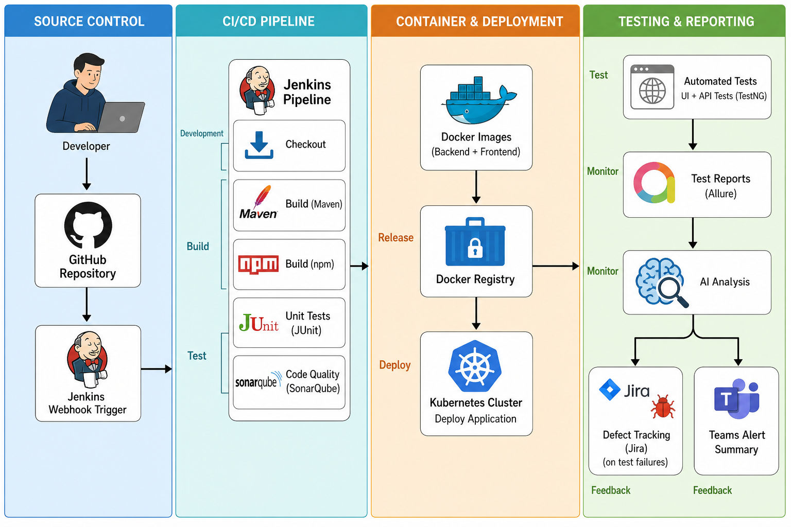

# Workflow

> Generic DevOps workflow diagram with standard lifecycle stages.

---

## Visual Diagram

---

## DevOps Lifecycle Mapping

| Lifecycle Stage | Column | Step |
|-----------------|--------|------|
| **Development** | Source Control / CI/CD | Developer → GitHub → Jenkins Webhook → Checkout |
| **Build** | CI/CD Pipeline | Build (Maven) → Build (npm) |
| **Test** | CI/CD Pipeline / Testing | Unit Tests (JUnit) → Code Quality (SonarQube) → Automated Tests |
| **Release** | Container & Deployment | Docker Images → Docker Registry |
| **Deploy** | Container & Deployment | Kubernetes Cluster |
| **Monitor** | Testing & Reporting | Test Reports (Allure) → AI Analysis |
| **Feedback** | Testing & Reporting | Defect Tracking (Jira) → Teams Alert Summary |

---

## Mermaid Source (editable / exportable)

```mermaid
flowchart LR
    subgraph SC["Source Control"]
        DEV["👨‍💻 Developer"]
        GH["GitHub Repository"]
        JEN["Jenkins Webhook Trigger"]
        DEV --> GH --> JEN
    end

    subgraph CI["CI/CD Pipeline"]
        direction TB
        S1["Checkout"]
        S2["Build (Maven)"]
        S3["Build (npm)"]
        S4["Unit Tests (JUnit)"]
        S5["Code Quality (SonarQube)"]
        S1 --> S2 --> S3 --> S4 --> S5
    end

    subgraph DEPLOY["Container & Deployment"]
        direction TB
        DOCK["Docker Images\n(Backend + Frontend)"]
        REG["Docker Registry"]
        K8S["Kubernetes Cluster\nDeploy Application"]
        DOCK --> REG --> K8S
    end

    subgraph TEST["Testing & Reporting"]
        direction TB
        SEL["Automated Tests\n(UI + API · TestNG)"]
        ALL["Test Reports (Allure)"]
        AI["AI Analysis"]
        JIRA["Defect Tracking (Jira)"]
        TEAMS["Teams Alert Summary"]
        SEL --> ALL --> AI
        AI --> JIRA
        AI --> TEAMS
    end

    JEN --> S1
    S5 --> DOCK
    K8S --> SEL
```

